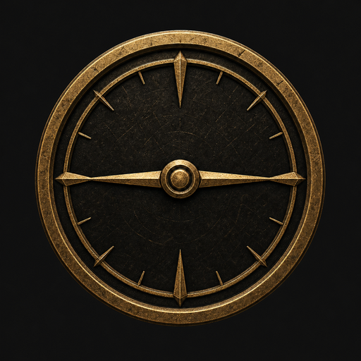

  

# Poe Dash
Analyze your Path of Exile 2 stash tabs with price checks and live monitoring.
This project is in active development, and I intend to build out some more community oriented features in the future.

## Releases
You can download the latest release from the [releases page](https://github.com/renews/poe-dash/releases).
Each release includes a Linux AppImage, a Windows installer and portable app, and a macOS DMG.

## Features

### 1. Account Synchronization

Easily sync your Path of Exile 2 account to fetch all your items.

- Fetches items from the trade website
- Automatically updates your local item database
- Provides real-time progress updates during synchronization
- Refresh individual items
- Perform a full refresh of all items

### 2. Item Management

Efficiently manage and view your items with powerful filtering options.

- Filter items by stash tab
- Search items using keywords
- View detailed item information

### 3. Live Monitoring

Stay up-to-date with new items as you dump them into your stash tabs.

- Receive instant notifications for new items
- Price check items as you add them to your stash
- Track your currency listed per hour

### 4. Price Checking

Get some-what accurate price estimates for your items.

- Estimate prices for individual items
- Batch price check multiple items

### 5. Chat Monitoring

Show item details of purchase offers if you have them in the item database

- Search chat offers for patterns in sales
- Price check items as you receive offers

## Devs Getting Started

1. Clone the repository
2. Install dependencies with `bun install`
3. Run the application with `bun run dev`
4. Enter your Path of Exile 2 account name to begin syncing your items

## Contributing
Contributions are welcome! Please feel free to submit a Pull Request.
